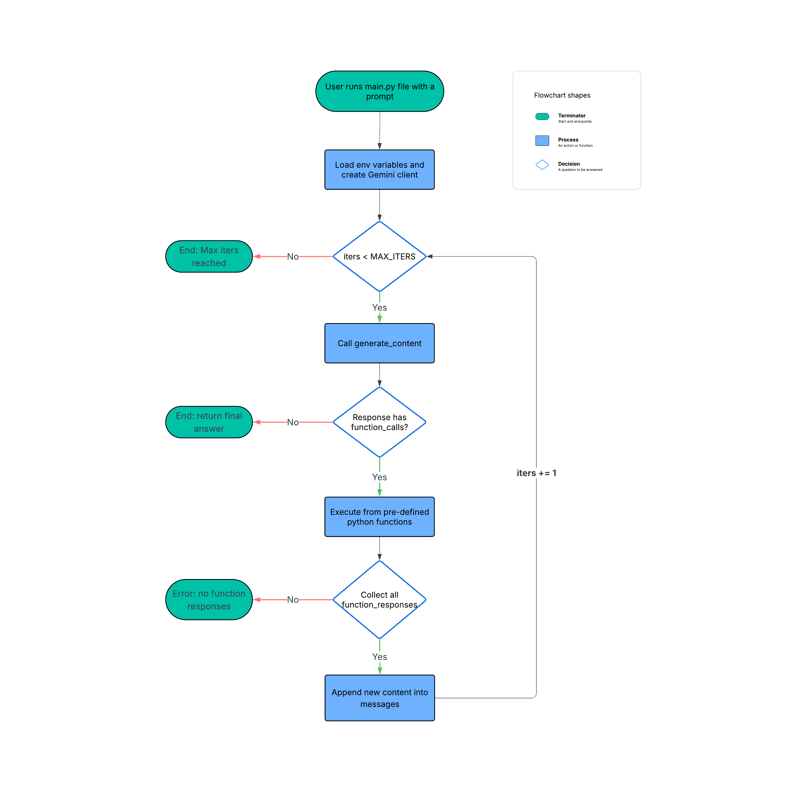

# CLI Code Agent

A powerful CLI coding assistant built in **Python** using the **Google Gemini API**—similar in spirit to tools like [Claude Code](https://www.claude.com/product/claude-code) and [Cursor CLI](https://cursor.com/cli).

Give it a natural-language task like:

> "Fix my calculator app, it's not starting correctly"

…and the agent will autonomously:

- Inspect files and folders in your project
- Read and analyze code
- Execute Python files
- Write and overwrite files with fixes

All operations stay within a **defined working directory** for safety.

Check out the full demo [here](https://www.youtube.com/watch?v=aRW7wZKC4_I)

---

## Features

- **LLM-Powered**: Uses [Google Gemini](https://ai.google.dev/gemini-api/docs) (`gemini-2.0-flash-001`)
- **Tool Calling**: Pre-defined Python functions for:
  - Listing files and folders
  - Reading file contents
  - Running Python scripts with arguments
  - Writing/overwriting files
- **Safety First**: All operations confined to a configured `WORKING_DIR`
- **Iterative Agent Loop**: Configurable `MAX_ITERS` for complex tasks

---

## Architecture Overview



### How It Works

1. **User Input**: `main.py` receives your prompt from the command line
2. **API Request**: Sends your prompt + system instructions + tool declarations to Gemini
3. **Agent Decision**: Gemini either:
   - Returns a **final text answer**, or
   - Returns **function calls** (e.g., "read this file", "run that script")
4. **Tool Execution**: Python executes the requested tools and feeds results back to Gemini
5. **Iteration**: Steps 3-4 repeat until Gemini produces a final answer or reaches `MAX_ITERS`

---

## Quick Start

### Prerequisites

- **Python 3.10+** installed
- **Google Gemini API key** ([Get one here](https://aistudio.google.com/api-keys))
- **[uv](https://docs.astral.sh/uv/)** installed (for dependency management)

### Installation

1. **Clone the repository**
```bash
   git clone https://github.com/sujitanireddy/cli-code-agent
   cd cli-code-agent
```

2. **Set up environment variables**
```bash
   touch .env
```
   
   Open `.env` and add your API key:
```
   GEMINI_API_KEY=your_gemini_api_key_here
```
   
   Get your API key from [Google AI Studio](https://aistudio.google.com/api-keys).

3. **Configure working directory**
   
   Open `config.py` and update `WORKING_DIR` to point to your target project:
```python
   WORKING_DIR = "relative-path-to-your-project-folder"
```

4. **Install dependencies and create virtual env using uv**
```bash
   uv sync
```

---

## Usage

### Basic Usage
```bash
uv run main.py "your coding task here"
```

**Example:**
```bash
uv run main.py "fix my calculator app, it's not starting correctly"
```

### Verbose Mode

Get detailed output including:
- The final user prompt
- Token usage (prompt & response)
- Tool call responses as the agent works
```bash
uv run main.py "fix my calculator app, it's not starting correctly" --verbose
```

---

## Safety & Limitations

- All file operations are restricted to the configured `WORKING_DIR`
- Maximum iterations configurable via `MAX_ITERS` to prevent infinite loops
- Agent can only execute Python files (not arbitrary shell commands)
- No network access or external API calls from agent tools

---

## Contributing

Contributions are welcome! Please feel free to submit a Pull Request.

---

## License

This project is open source. Please check the repository for license details.